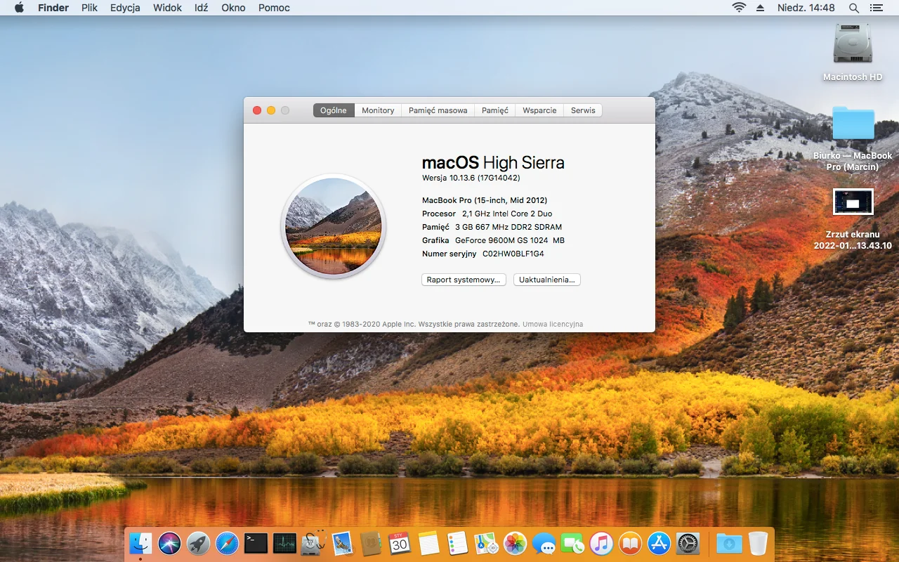
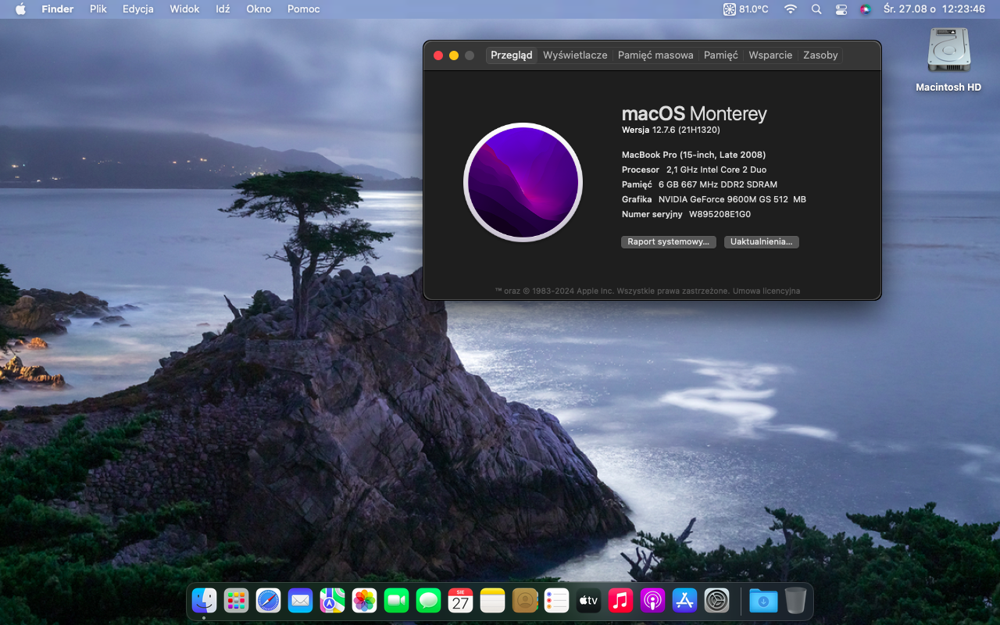
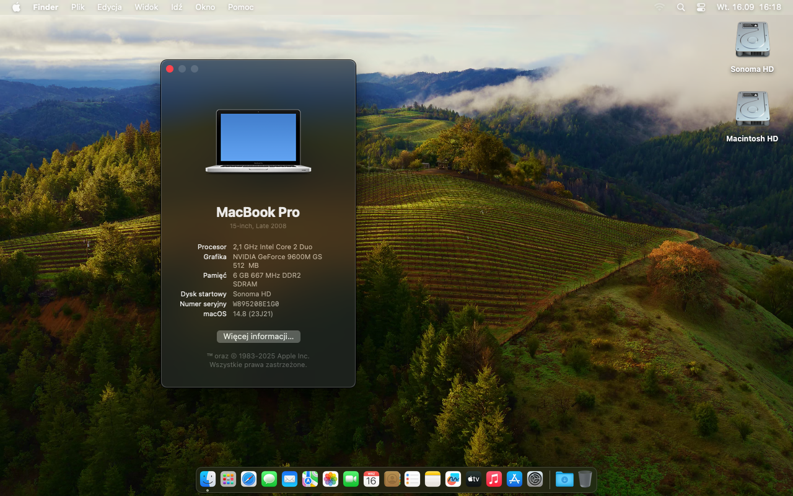
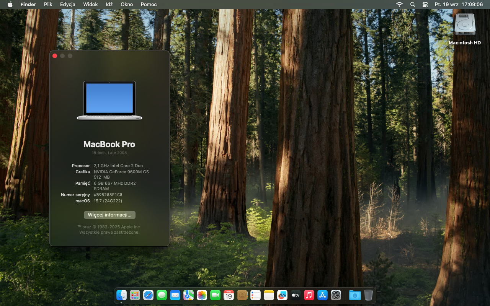

# Hackintosh – OpenCore for Lenovo IdeaPad Y530

Pre-made EFI of the **OpenCore bootloader** for Lenovo IdeaPad Y530.  
Tested on hardware with **Core 2 Duo T6500** + **Nvidia GeForce 9600M GS**.

## ⚡ Current Version
- OpenCore **1.0.5 DEBUG**  
- Download official release: [OpenCorePkg 1.0.5](https://github.com/acidanthera/OpenCorePkg/releases/tag/1.0.5)

## 📑 Table of Contents
- [Requirements](#requirements)
- [Screenshots](#screenshots)
- [Installation Notes](#installation-notes)
- [SMBIOS](#smbios)
- [macOS Compatibility](#macos-compatibility)
- [System Notes](#system-notes)
  - [High Sierra](#high-sierra)
  - [Monterey](#monterey)
  - [Ventura](#ventura)
  - [Sonoma](#sonoma)
  - [Sequoia](#sequoia)
- [What Works / What Doesn’t?](#whats-working)
- [Credits](#credits)

## 💻 Requirements
- Lenovo IdeaPad Y530  
- Intel Core 2 Duo CPU (**T9900 recommended**)  
- Nvidia GeForce 9600M GS (ROM: [latest Lenovo version](https://www.techpowerup.com/vgabios/?architecture=NVIDIA&manufacturer=&model=9600M+GS))  
- SATA SSD (strongly recommended)  
- Maximum supported RAM  

> [!NOTE]  
> Upgrade CPU, RAM, and install an SSD to avoid slowdowns.

## 🖼 Screenshots

<table>
  <tr>
    <td align="center">
      <br>
      <em>macOS 10.13.6 (High Sierra)</em>
    </td>
    <td align="center">
      <br>
      <em>macOS 12.7.6 (Monterey)</em>
    </td>
  </tr>
  <tr>
    <td align="center">
      <br>
      <em>macOS 14.8 (Sonoma)</em>
    </td>
    <td align="center">
      <br>
      <em>macOS 15.7 (Sequoia)</em>
    </td>
  </tr>
</table>

## 🔧 Installation Notes

1. This is a **legacy system** → you must create your own boot file (USB + internal EFI).  
   - **Windows:** [Legacy Setup - DiskPart Method](https://dortania.github.io/OpenCore-Install-Guide/installer-guide/winblows-install.html#diskpart-method)  
   - **macOS:** [Legacy Setup](https://dortania.github.io/OpenCore-Install-Guide/installer-guide/mac-install.html#legacy-setup)

2. Nvidia Tesla GPU:  
   - Follow [Legacy Nvidia Patching Guide](https://dortania.github.io/OpenCore-Post-Install/gpu-patching/nvidia-patching/) before installing macOS, using ROM from the [Requirements section](#requirements).  

3. NVRAM doesn't work, you will have to emulate it, see [NVRAM Emulation with nvram.plist](https://dortania.github.io/OpenCore-Post-Install/misc/nvram.html#emulating-nvram-with-a-nvram-plist).

## 🖥 SMBIOS

⚠️ SMBIOS in this repo is **only sample**.  
Generate your own using [GenSMBIOS](https://github.com/corpnewt/GenSMBIOS).  

- Use **unused / invalid SMBIOS**.  
- Needed only for iServices.  

## 🍏 macOS Compatibility

| Version     | Status       | Notes |
|-------------|-------------|-------|
| High Sierra | ✅ Works | Hardware "officially" supported |
| Big Sur and newer   | ⚠️ Requires patching | Needs OCLP patches for non-Metal acceleration |
| Ventura and newer   | ⚠️ Requires `PCI enumeration` quirk | Otherwise stalls with `IOPCIConfigurator::configure kIOPCIEnumerationWaitTime is 900` |

## 📝 System Notes

See issues/workarounds: [OCLP Issue #108](https://github.com/dortania/OpenCore-Legacy-Patcher/issues/108) for macOS 11+!


### High Sierra - Catalina (10.13.x - 10.15.x):
- Works with Intel WiFi when SecureBootModel is set to `j137`.  
- Troubleshooting: [Apple Secure Boot special notes](https://dortania.github.io/OpenCore-Post-Install/universal/security/applesecureboot.html#special-notes-with-securebootmodel)

**Note**: For macOS 10.14+, use `telemetrytrap` kext to patch missing SSE4.2:
  - Add [telemetrytrap](https://forums.macrumors.com/attachments/telemetrap-0-22-zip.913289/) kext.

### Big Sur (11.x):

Steps to prepare with config.plist:

1.  Use `telemetrytrap` kext to patch missing SSE4.2:
  - Add [telemetrytrap](https://forums.macrumors.com/attachments/telemetrap-0-22-zip.913289/) kext,

2. Use AMFIPass to bypass disabling AMFI for root patching:
  - Add [AMFIPass](https://github.com/dortania/OpenCore-Legacy-Patcher/blob/main/payloads/Kexts/Acidanthera/AMFIPass-v1.4.1-RELEASE.zip) kext,

3. Set SIP to 0x803:

  - `NVRAM` → `Add` → `7C436110-AB2A-4BBB-A880-FE41995C9F82` → `csr-active-config` → `03080000`,

4. Disable Apple Secure Boot:

  - `Misc` → `Security` → `SecureBootModel` → `Disable`,

5. Disable Signed DMGs loading:

  - `Misc` → `Security` → `DmgLoading` → `Any`,

6. Reset NVRAM

  - Using `ResetNvramEntry.efi` in `EFI/OC/DRIVERS`.

7. In Recovery:
   ```sh
   csrutil disable --no-internal
   csrutil authenticated-root disable
   ```  
8. Run latest OCLP

### Monterey (12.x):

Steps to prepare with config.plist:

1. Follow [Big Sur steps](#big-sur-11x) (1-6),

2. Patch AVX1 in CompressionTypeZlib for macOS 12.4+:

  - Add [NoAVXFSCompressionTypeZlib](https://github.com/dortania/OpenCore-Legacy-Patcher/blob/main/payloads/Kexts/Misc/NoAVXFSCompressionTypeZlib-v12.3.1.zip) kext,

3. Run latest OCLP (>= 0.4.5).

### Ventura and newer
~~Currently unstable, gets stuck at `IOPCIConfigurator::configure kIOPCIEnumerationWaitTime is 900`.~~

**FIXED**: Requires `PCI Enumeration` (`Kernel → Patch` quirk) in config.plist to fix the issue.  

### Ventura (13.x, OCLP 0.6.0+)

Steps to prepare with config.plist:

1. Follow [Big Sur steps](#big-sur-11x) (1-6),

2. Set SMBIOS → `MacBookPro14,x`:
  - Use [GenSMBIOS](https://github.com/corpnewt/GenSMBIOS),

3. Patch AVX1 in FSCompressionTypeZlib for macOS 13+:

  - Remove/Disable/Set `MaxKernel` to `21.99.99` for [NoAVXFSCompressionTypeZlib](https://github.com/dortania/OpenCore-Legacy-Patcher/blob/main/payloads/Kexts/Misc/NoAVXFSCompressionTypeZlib-v12.3.1.zip) kext,
  - Add [NoAVXFSCompressionTypeZlib-AVXpel](https://github.com/dortania/OpenCore-Legacy-Patcher/blob/main/payloads/Kexts/Misc/NoAVXFSCompressionTypeZlib-AVXpel-v12.6.zip), setting `MinKernel` to `22.00.00`,

4. Use Rosetta 2 Cryptex to patch AVX2 for macOS 13+:
  - Add [CryptexFixup](https://github.com/acidanthera/CryptexFixup/releases/latest) kext, setting `MinKernel` to `22.00.00`,

5. Use `RSRHelper` to handle Rapid Security Response updates for macOS 13.3+:
  - Add [RSRHelper](https://github.com/dortania/OpenCore-Legacy-Patcher/blob/main/payloads/Kexts/Acidanthera/RSRHelper-v1.0.2-DEBUG.zip) kext, setting `MinKernel` to `22.00.00`,

6. Resolve removed `AppleIntelCPUPowerManagement` in macOS 13+:
  - Enable `DummyPowerManagement` quirk:
    - `Kernel` → `Emulate` → `DummyPowerManagement` → `True`,
  - Add [AppleIntelCPUPowerManagement](https://github.com/dortania/OpenCore-Legacy-Patcher/blob/main/payloads/Kexts/Misc/AppleIntelCPUPowerManagement-v1.0.0.zip) and [AppleIntelCPUPowerManagementClient](https://github.com/dortania/OpenCore-Legacy-Patcher/blob/main/payloads/Kexts/Misc/AppleIntelCPUPowerManagementClient-v1.0.0.zip) kexts, setting `MinKernel` to `22.00.00`,

7. Fix PCI Enumeration stall (`Kernel` → `Patch` quirk), setting as follows (Ventura only):

    | Key          | Type       | Value                                                           |
    |--------------|------------|-----------------------------------------------------------------|
    | Arch         | String     | x86_64                                                          |
    | Base         | String     | __ZN17IOPCIBridge0HotplugPortEP16IOPCIConfigEntry               |
    | Comment      | String     | Fix PCI bus enumeration (Ventura)                               |
    | Count        | Number     | 1                                                               |
    | Enabled      | Boolean    | True                                                            |
    | Find         | Data       | <84DB754B 418B5738>                                             |
    | Identifier   | String     | com.apple.iokit.IOPCIFamily                                     |
    | Limit        | Number     | 0                                                               |
    | Mask         | Data       |                                                                 |
    | MaxKernel    | String     | 22.99.99                                                        |
    | MinKernel    | String     | 22.0.0                                                          |
    | Replace      | Data       | 84DBEB4B 418B5738                                               |
    | ReplaceMask  | Data       |                                                                 |
    | Skip         | Number     | 0                                                               |

8. In Recovery:
   ```sh
   csrutil disable --no-internal
   csrutil authenticated-root disable
   ```
9. Run latest OCLP (>= 0.6.0).

### Sonoma (OCLP 1.0.0+)

1. Follow [Big Sur steps](#big-sur-11x) (1-6),
2. Set SMBIOS → `MacBookPro15,x`:
  - Use [GenSMBIOS](https://github.com/corpnewt/GenSMBIOS),
3. Use Intel WiFi kext compatible with Sonoma,
4. Fix PCI Enumeration stall (`Kernel` → `Patch` quirk), setting as follows (Sonoma+):

    | Key          | Type       | Value                                                           |
    |--------------|------------|-----------------------------------------------------------------|
    | Arch         | String     | x86_64                                                          |
    | Base         | String     | __ZN17IOPCIConfigurator18IOPCIIsHotplugPortEP16IOPCIConfigEntry |
    | Comment      | String     | Fix PCI bus enumeration (Sonoma)                                |
    | Count        | Number     | 1                                                               |
    | Enabled      | Boolean    | True                                                            |
    | Find         | Data       | 4584E475 4B                                                     |
    | Identifier   | String     | com.apple.iokit.IOPCIFamily                                     |
    | Limit        | Number     | 0                                                               |
    | Mask         | Data       |                                                                 |
    | MaxKernel    | String     |                                                                 |
    | MinKernel    | String     | 23.0.0                                                          |
    | Replace      | Data       | 4584E4EB 4B                                                     |
    | ReplaceMask  | Data       |                                                                 |
    | Skip         | Number     | 0                                                               |

5. In Recovery:
   ```sh
   csrutil disable --no-internal
   csrutil authenticated-root disable
   ```

6. Run latest OCLP (>= 1.0.0).

### Sequoia (OCLP 2.0.0+)

1. Follow [Big Sur steps](#big-sur-11x) (1-6) and [Sonoma steps](#sonoma) (1-5),
2. ⚠️ No Intel WiFi kexts (without root patching) → **Ethernet only**
  - Remove `Airportitlwm.kext` from `EFI/OC/KEXTS`,
  - Make sure to use [BCM5722D](https://github.com/chris1111/BCM5722D/releases) kext for Ethernet! 
3. (Optional/Post Install) Spoofing Intel WiFi and patching with OCLP:
  - Add following kexts to `EFI/OC/KEXTS` and set `MinKernel` to `24.0.0` for each:
    - `Airportitlwm.kext` (v2.3.0 for **Ventura**),
    - `IOSkywalkFamily.kext`,
    - `IO80211FamilyLegacy.kext`,
    - `IO80211FamilyLegacy.kext/Contents/PlugIns/AirPortBrcmNIC.kext`.
  - Using Hackintool, go to `PCIe` tab, find your Intel WiFi → `Copy DevicePath`,
  - Open `config.plist` with ProperTree,
  - Add your Intel WiFi card: `DeviceProperties` → `Add` → `PciRoot(0x0)/Pci(0x1F,0x3)` (example, use your own path),
  - Spoof your Intel WiFi card:

    | Key                 | Type   | Value                                      |
    |---------------------|--------|--------------------------------------------|
    | IOName              | String | pci14e4,43a0                               |
    | compatible          | String | pci106b,117                                |
    | device-id           | Data   | A0430000                                   |
    | device_type         | String | Network Controller                         |
    | model               | String | BCM4360 802.11ac Wireless Network Adapter  |
    | name                | String | pci14e4,43a0                               |
    | pci-aspm-default    | Number | 0                                          |
    | subsystem-id        | Data   | 17010000                                   |
    | subsystem-vendor-id | Data   | 6B100000                                   |
    | vendor-id           | Data   | E4140000                                   |

  - Enable `Kernel` → `Block` → `Allow IOSkywalk Downgrade`, make sure `MinKernel` is set to `24.0.0` for Sequoia:

    | Identifier                     | Comment                  | Enabled | Strategy | MinKernel | MaxKernel | Arch   |
    |--------------------------------|--------------------------|---------|----------|-----------|-----------|--------|
    | com.apple.iokit.IOSkywalkFamily | Allow IOSkywalk Downgrade | true    | Exclude  | 24.0.0  |           | x86_64 |


4. Run latest OCLP (>= 2.0.0),

5. (**Optional, if you did spoofing**) After root-patching with OCLP, comment out (by adding `#`) your Intel WiFi card in `DeviceProperties` to make it work normally:
  - `EFI/OC/config.plist` → `DeviceProperties` → `Add` → `#PciRoot(0x0)/Pci(0x1F,0x3)` (example, use your own path).

6. Finally, reboot and enjoy Intel WiFi on Sequoia!

**NOTE:** You will need to repeat the spoofing, patching and commenting out steps after every macOS update.

## ✅ What’s Working
1. Intel WiFi:
  - High Sierra with j137 SBM, 
  - Up to Sonoma with with proper kext,
  - Sequoia requires temportary spoofing and patching (Annoying but works).  
2. Broadcom Ethernet,  
3. USB ports  
4. CD/DVD drive  
5. iServices (with proper SMBIOS)

## ⚠️ Partially Working
- Trackpad (feels too sensitive, use USB mouse).

## ❌ What’s Not Working
- Bluetooth (it's BCM2046, but mine seems dead),
- Audio (ALC888, no supported layout-id found),  
- SD card slot,  
- Fan monitoring,
- Sleep / Hibernation,
- Shutdown (macOS will shut down but the laptop will stay on).

## 🙏 Credits

### Bootloader, Resources & Tools
- [OpenCorePkg](https://github.com/acidanthera/OpenCorePkg)
- [OpenCanopy Resources](https://github.com/acidanthera/OcBinaryData)  
- [OpenCore Legacy Patcher](https://github.com/dortania/OpenCore-Legacy-Patcher)
- [GenSMBIOS](https://github.com/corpnewt/GenSMBIOS)  

### Kexts
- [Lilu](https://github.com/acidanthera/Lilu/)  
- [WhateverGreen](https://github.com/acidanthera/WhateverGreen)  
- [VirtualSMC](https://github.com/acidanthera/VirtualSMC)  
- [AppleALC](https://github.com/acidanthera/AppleALC)  
- [Airportitlwm](https://github.com/OpenIntelWireless/itlwm)  
- [VoodooPS2](https://github.com/acidanthera/VoodooPS2)  
- [VoodooInput](https://github.com/acidanthera/VoodooInput)  
- [USBInjectAll](https://bitbucket.org/RehabMan/os-x-usb-inject-all/downloads)  
- [NoAVXFSCompressionTypeZlib](https://github.com/dortania/OpenCore-Legacy-Patcher/blob/main/payloads/Kexts/Misc/)  
- [AMFIPass](https://github.com/dortania/OpenCore-Legacy-Patcher/blob/main/payloads/Kexts/Acidanthera/AMFIPass-v1.4.1-RELEASE.zip)
- [CryptexFixup](https://github.com/acidanthera/CryptexFixup)