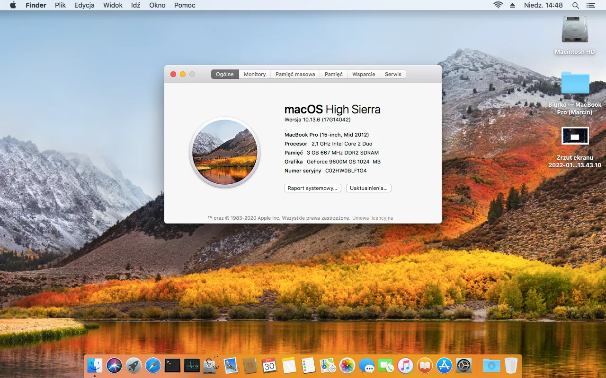

# Hackintosh – OpenCore for Lenovo IdeaPad Y530

Pre-made EFI of the **OpenCore bootloader** for Lenovo IdeaPad Y530.  
Tested on hardware with **Core 2 Duo T6500** + **Nvidia GeForce 9600M GS**.

## ⚡ Current Version
- OpenCore **1.0.5 DEBUG**  
- Download official release: [OpenCorePkg 1.0.5](https://github.com/acidanthera/OpenCorePkg/releases/tag/1.0.5)

## 📑 Table of Contents
- [Requirements](#requirements)
- [Screenshots](#screenshots)
- [Installation Notes](#installation-notes)
- [SMBIOS](#smbios)
- [macOS Compatibility](#macos-compatibility)
- [System Notes](#system-notes)
  - [High Sierra](#high-sierra)
  - [Monterey](#monterey)
  - [Ventura](#ventura)
  - [Sonoma](#sonoma)
  - [Sequoia](#sequoia)
- [What Works / What Doesn’t?](#whats-working)
- [Credits](#credits)

## 💻 Requirements
- Lenovo IdeaPad Y530  
- Intel Core 2 Duo CPU (**T9800 recommended**)  
- Nvidia GeForce 9600M GS (ROM: [latest Lenovo version](https://www.techpowerup.com/vgabios/?architecture=NVIDIA&manufacturer=&model=9600M+GS))  
- SATA SSD (strongly recommended)  
- Maximum supported RAM  

> [!NOTE]  
> Upgrade CPU, RAM, and install an SSD to avoid slowdowns.

## 🖼 Screenshots

<p align="center">
  <br>
  <em>macOS 10.13.6 (High Sierra)</em>
</p>

<p align="center">
  <br>
  <em>macOS 12.7.6 (Monterey)</em>
</p>

## 🔧 Installation Notes

1. This is a **legacy system** → you must create your own boot file (USB + internal EFI).  
   - **Windows:** [Legacy Setup - DiskPart Method](https://dortania.github.io/OpenCore-Install-Guide/installer-guide/winblows-install.html#diskpart-method)  
   - **macOS:** [Legacy Setup](https://dortania.github.io/OpenCore-Install-Guide/installer-guide/mac-install.html#legacy-setup)

2. Nvidia Tesla GPU:  
   - Follow [Legacy Nvidia Patching Guide](https://dortania.github.io/OpenCore-Post-Install/gpu-patching/nvidia-patching/) before installing macOS, using ROM from the [Requirements section](#requirements).  

3. NVRAM doesn't work, you will have to emulate it, see [NVRAM Emulation with nvram.plist](https://dortania.github.io/OpenCore-Post-Install/misc/nvram.html#emulating-nvram-with-a-nvram-plist).

## 🖥 SMBIOS

⚠️ SMBIOS in this repo is **only sample**.  
Generate your own using [GenSMBIOS](https://github.com/corpnewt/GenSMBIOS).  

- Use **unused / invalid SMBIOS**.  
- Needed only for iServices.  

## 🍏 macOS Compatibility

| Version     | Status       | Notes |
|-------------|-------------|-------|
| High Sierra | ✅ Works | Hardware "officially" supported |
| Monterey    | ⚠️ Requires patching | Needs OCLP patches for non-Metal acceleration |
| Ventura and newer     | ❌ Stalls | `IOPCIConfigurator::configure kIOPCIEnumerationWaitTime is 900` |

## 📝 System Notes

See issues/workarounds: [OCLP Issue #108](https://github.com/dortania/OpenCore-Legacy-Patcher/issues/108) for macOS 11+!

### High Sierra
- Works with Intel WiFi when SecureBootModel is set to `j137`.  
- Troubleshooting: [Apple Secure Boot special notes](https://dortania.github.io/OpenCore-Post-Install/universal/security/applesecureboot.html#special-notes-with-securebootmodel)

### Monterey

Steps:
1. Disable Apple Secure Boot  
2. Set SIP to `0x802`  
3. Disable AMFI (`amfi=0x80`)  
4. Add `NoAVXFSCompressionTypeZlib` kext for 12.4+  
5. In Recovery:
   ```sh
   csrutil disable --no-internal
   csrutil authenticated-root disable
   ```  
6. Run latest OCLP (>= 0.4.5)

### Ventura and newer
Currently unstable, gets stuck at `IOPCIConfigurator::configure kIOPCIEnumerationWaitTime is 900`.  

<details>
<summary>Preparation steps -> Click to expand</summary>

### Ventura (OCLP 0.6.0+)

* SMBIOS → `MacBookPro14,x`
* Disable **Apple Secure Boot**
* SIP → `0x803`
* Disable **AMFI** (`amfi=0x80 ipc_control_port_options=0`)
  or use [AMFIPass](https://github.com/dortania/OpenCore-Legacy-Patcher/blob/main/payloads/Kexts/Acidanthera/AMFIPass-v1.4.1-RELEASE.zip)
* Add kexts:

  * [NoAVXFSCompressionTypeZlib-AVXpel](https://github.com/dortania/OpenCore-Legacy-Patcher/blob/main/payloads/Kexts/Misc/NoAVXFSCompressionTypeZlib-AVXpel-v12.6.zip)
  * [CryptexFixup](https://github.com/acidanthera/CryptexFixup/)
* Use **Intel WiFi kext** (Ventura-compatible)
* In Recovery:

  ```sh
  csrutil disable --no-internal
  csrutil authenticated-root disable
  ```

### Sonoma (OCLP 1.0.0+)

* SMBIOS → `MacBookPro15,x`
* Use **Intel WiFi kext** (Sonoma-compatible)
* Otherwise identical to Ventura setup

### Sequoia (OCLP 2.0.0+)

* SMBIOS → `MacBookPro15,x` (still supported)
* ⚠️ No Intel WiFi kexts → **Ethernet only**
* Otherwise identical to Ventura setup

</details>

## ✅ What’s Working
- Intel WiFi (High Sierra with j137 SBM)  
- Broadcom Ethernet  
- USB ports  
- CD/DVD drive  
- iServices (with proper SMBIOS)

## ⚠️ Partially Working
- Trackpad (feels too sensitive, use USB mouse)

## ❌ What’s Not Working
- Audio (ALC888, no supported layout-id found)  
- SD card slot  
- Fan monitoring

## 🙏 Credits

### Bootloader, Resources & Tools
- [OpenCorePkg](https://github.com/acidanthera/OpenCorePkg)
- [OpenCanopy Resources](https://github.com/acidanthera/OcBinaryData)  
- [OpenCore Legacy Patcher](https://github.com/dortania/OpenCore-Legacy-Patcher)  
- [GenSMBIOS](https://github.com/corpnewt/GenSMBIOS)  

### Kexts
- [Lilu](https://github.com/acidanthera/Lilu/)  
- [WhateverGreen](https://github.com/acidanthera/WhateverGreen)  
- [VirtualSMC](https://github.com/acidanthera/VirtualSMC)  
- [AppleALC](https://github.com/acidanthera/AppleALC)  
- [Airportitlwm](https://github.com/OpenIntelWireless/itlwm)  
- [VoodooPS2](https://github.com/acidanthera/VoodooPS2)  
- [VoodooInput](https://github.com/acidanthera/VoodooInput)  
- [USBInjectAll](https://bitbucket.org/RehabMan/os-x-usb-inject-all/downloads)  
- [NoAVXFSCompressionTypeZlib](https://github.com/dortania/OpenCore-Legacy-Patcher/blob/main/payloads/Kexts/Misc/)  
- [AMFIPass](https://github.com/dortania/OpenCore-Legacy-Patcher/blob/main/payloads/Kexts/Acidanthera/AMFIPass-v1.4.1-RELEASE.zip)